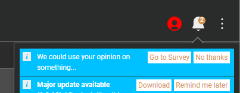

# Vortex-Backend

This repo contains all the live files that Vortex accesses and any relevant Actions that are needed to update them. They are contained in the `/out` folder.

- extensions-manifest.json
- announcements.json
- surveys.json
- gameversion_hashmap.json

## `extensions-manifest.json`

This contains all the information that Vortex uses to know what extensions (of all types) are available to download and use.

This is updated on demand or scheduled via a GitHub Action which loops through the manifest and updates any download stats. It removes any extensions that have been deleted or hidden. If files have been updated, these versions are checked and the most recent one is updated tool.

> Completely new extensions aren't added automatically as we verify these manually and there isn't an automated way of linking extensions to the games they are supporting etc. To add a new extension to the manifest, the 'Add Extension' github action is used.

See below: [GitHub Actions](#github-actions)

## `announcements.json`

The announcements file is an array of `IAnnouncement` objects.

This is downloaded from GitHub when Vortex loads or if running a development build and `%APPDATA%\vortex_devel\temp\announcements.json` exists, then this local file is used instead.  

```json
{ 
    "date": "2019-01-14T10:20:10", 
    "description": "This is a fake announcement", 
    "link": "www.github.com", 
    "severity": "critical", 
    "gamemode": "skyrim", 
    "icon": "bug" 
}
```

- `date` - MANDATORY - Expects a valid date in ISO 8601 format.
- `description` - MANDATORY - The announcement text you wish to display.
- `link` - When a URL is provided, Vortex will generate a button for the announcement allowing the users to click and open the URL in a new webpage.
- `severity` - This element accepts one of the following: "information" | "warning" | "critical"; this will modify UI elements accordingly to highlight the severity type of the announcement. (Currently only changes the color of the announcement's icon)
- `gamemode` - Providing a specific game id will only show this announcement when actively managing the game matching the game id.
- `icon` - The name of the icon we wish to add to this announcement - When provided, Vortex will search for the icon's name within its icon selection and attempt to display it alongside the description.
- `version` - Providing a specific version number will ensure that the announcement only shows inside copies of Vortex with that specific version number.


> Please note: Upon changing the announcements.json file, it may take up to 5 minutes for the changes to be reflected within Vortex. This is probably due to some github caching mechanism or possibly just because it takes a little while for the raw page to be queryable. During this time, Vortex's requests will return the old JSON file (pre-edit).


## `surveys.json`

The survey file is an array of `ISurveyInstance` objects

```json
{
    "id": "vortex-sdv-feedback-1",
    "endDate": "2022-08-18T12:00:00",
    "link": "https://forms.gle/pk2vabpgCQSC4fteA",
    "gamemode": "stardewvalley"
}
```

- `id` - MANDATORY - unique id for this survey
- `endDate` - MANDATORY - end date of survey
- `link` - MANDATORY - link to survey
- `gamemode` - specific for a gamemode



## `gameversion_hashmap.json`

This is complicated


## GitHub Actions

### Update Extension Manifest

Runs scheduled every day 08:45 or manually via workflow_dispatch.

This workflow reads the current manifest and refreshes download and endorsement count for existing extensions. It marks mods that have have been hidden or deleted. If files have been updated, the download URLs are updated to.

#### Inputs

- `dry-run` - Defaults to false, if set to true then the last commit and push step isn't performed.

### Add Extension

This adds a new extension to the manifest.

Run manually via workflow_dispatch.

#### Inputs

- `modid` - REQUIRED - Mod ID of the extension that needs adding e.g. `598`
- `extension-type` - REQUIRED - What type of extension is being added. Choose from game, theme, translation or tool. Which one chosen determines what else must be inputted.
- `gamedomain` - REQUIRED FOR GAME TYPE - Nexus site gamedomain that this extension provides support for. e.g. `back4blood`
- `language` - REQUIRED FOR TRANSLATION TYPE - Language tag that this translation is for. e.g. `es-MX` for Spanish (Mexico)
- `dry-run` - Defaults to false, if set to true then the last commit and push step isn't performed.
